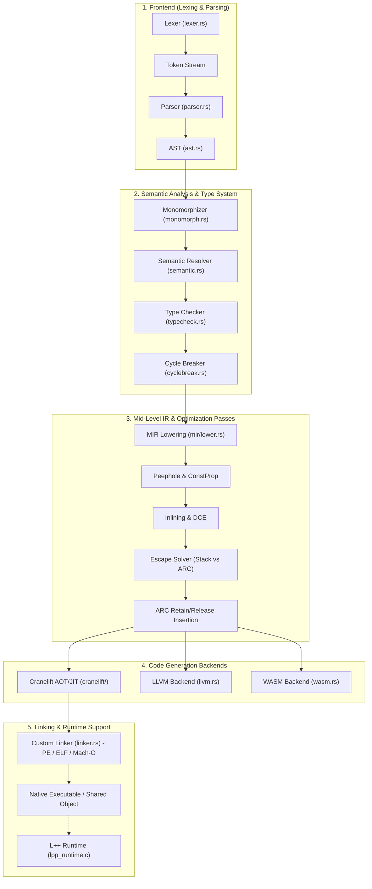

# L++ Architecture Documentation

> Generated via GitNexus Knowledge Graph & Compiler Source Analysis

---

## 1. Overview & Codebase Statistics

L++ is a high-performance, statically typed, memory-safe systems programming language featuring deterministic Automatic Reference Counting (ARC) with static cycle breaking, stack promotion via whole-program escape analysis, and an ultra-fast multi-backend compilation pipeline (Cranelift AOT/JIT, LLVM, WebAssembly) with custom built-in cross-platform linkers (PE, ELF, Mach-O).

### Repository Statistics (via GitNexus)
- **Source Files**: 868 files indexed
- **Symbols**: 21,104 symbols
- **Execution Flows**: 300 distinct execution flows
- **Core Engine**: Rust compiler (`src/`) + native C runtime (`lpp_runtime.c`)

---

## 2. Functional Areas (Subsystems & Clusters)

### Module Breakdown

| Subsystem | Key Files | Responsibility |
|---|---|---|
| **Frontend** | [`lexer.rs`](file:///c:/Users/khati/lpp/src/frontend/lexer.rs), [`parser.rs`](file:///c:/Users/khati/lpp/src/frontend/parser.rs), [`ast.rs`](file:///c:/Users/khati/lpp/src/frontend/ast.rs) | Converts UTF-8 source into token streams, validates escape sequences and indentation, builds strongly typed AST. |
| **Analysis** | [`monomorph.rs`](file:///c:/Users/khati/lpp/src/analysis/monomorph.rs), [`semantic.rs`](file:///c:/Users/khati/lpp/src/analysis/semantic.rs), [`typecheck.rs`](file:///c:/Users/khati/lpp/src/analysis/typecheck.rs), [`cyclebreak.rs`](file:///c:/Users/khati/lpp/src/analysis/cyclebreak.rs) | Generic instantiation, lexical scoping, symbol binding, trait resolution, type checking, and compile-time ownership cycle detection. |
| **MIR** | [`mir/lower.rs`](file:///c:/Users/khati/lpp/src/mir/lower.rs), `pass_*.rs`, [`escape_solver.rs`](file:///c:/Users/khati/lpp/src/mir/escape_solver.rs) | Lowers AST to Control Flow Graph (CFG) of basic blocks, runs constant propagation, inlining, scalar optimizations, whole-function escape solving, and deterministic ARC lifetime instrumentation. |
| **Backend** | [`cranelift/`](file:///c:/Users/khati/lpp/src/backend/cranelift/), [`llvm.rs`](file:///c:/Users/khati/lpp/src/backend/llvm.rs), [`wasm.rs`](file:///c:/Users/khati/lpp/src/backend/wasm.rs) | Lowers MIR to machine code via Cranelift (default), LLVM (optimized release), or WebAssembly. |
| **Linker & Runtime** | [`linker.rs`](file:///c:/Users/khati/lpp/src/linker.rs), [`lpp_runtime.c`](file:///c:/Users/khati/lpp/lpp_runtime.c) | Self-contained zero-dependency linker producing native PE/COFF, ELF, and Mach-O binaries, linked with the minimal ARC and arena memory runtime. |

---

## 3. Key Execution Flows

### 1. Compilation Pipeline (`main.rs::compile_file`)
1. **Source Loading & Lexing**: `Lexer::tokenize` converts `.lpp` source text into `Vec<SpannedToken>`.
2. **Parsing**: `Parser::parse` constructs the root `Program` AST node.
3. **Import Resolution**: Merges dependent AST declarations across modules.
4. **Monomorphization**: Clones and specializes generic types, functions, and trait implementations with concrete type arguments.
5. **Semantic Scope Resolution**: Validates identifier bindings, mutability rules, and closure captures.
6. **Type Checking**: Validates type contracts, operators, and method signatures; computes `TypeTable`.
7. **Cycle Breaking**: Analyzes struct dependency graphs; demotes back-edges to weak references or marks recursive types for arena allocation.
8. **MIR Generation**: Transforms AST to basic-block MIR representation.
9. **MIR Optimization Pipeline**: Runs constant folding, copy propagation, strength reduction, dead code elimination, and inlining.
10. **Escape Analysis**: Computes value vs reference escape status to stack-promote non-escaping allocations.
11. **ARC Instrumentation**: Inserts `lpp_arc_retain` and `lpp_arc_release` calls strictly on surviving reference edges.
12. **Codegen**: Emits machine code via Cranelift `ObjectModule`.
13. **Linking**: Packages object bytes into target executable (PE/ELF/Mach-O) with embedded runtime.

### 2. Arithmetic & Expression Lowering
Expressions are lowered through `mir::lower` to `Rvalue::BinaryOp`, which backend lowerers (`cranelift/lower.rs`) map to machine instructions with strict safety traps:
- Integer addition, subtraction, multiplication (`iadd`, `isub`, `imul`)
- Integer division and modulo (`sdiv`, `srem` guarded against division by zero and signed overflow)
- Bitwise shifts (`ishl`, `sshr` guarded against shift counts `< 0` or `>= 64`)

### 3. Memory & Lifetime Management
- **Stack Promotion**: Values that do not escape their declaring frame are allocated directly on the stack with 0 refcount overhead.
- **ARC (Atomic Reference Counting)**: Thread-shared references use atomic refcounting (`lpp_arc_retain` / `lpp_arc_release`), while function-local single-threaded references use fast non-atomic updates.
- **Arena Regions**: Self-referential and cyclic graphs are allocated in function-scoped arenas (`lpp_arena_alloc`) and reclaimed in bulk at frame exit.
