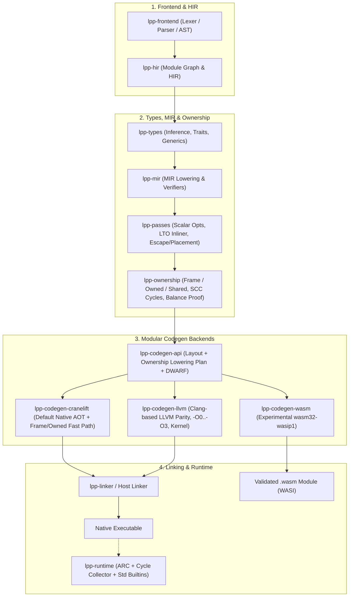

# L++ Architecture Documentation

> Modular rewrite architecture across `crates/lpp-*` and `crates/keel`. For verified per-backend boundaries and limitations, see [specs.md](specs.md) and [documentation/CURRENT_CAPABILITIES.md](documentation/CURRENT_CAPABILITIES.md).

---

## 1. Overview & Workspace Architecture

L++ is a statically typed compiled systems and application language built on a verified multi-stage Rust workspace (`crates/lpp-*`):

- **CLI Entrypoint**: [`src/main.rs`](src/main.rs) unconditionally invokes `lpp_driver::RewriteEngine`.
- **Hosted Runtime**: [`crates/lpp-runtime`](crates/lpp-runtime) (atomic ARC, Bacon-Rajan trial-deletion cycle collector for native `Shared` objects, strings, collections, OS/file/JSON builtins), paired with freestanding C/platform sources under [`runtime/`](runtime/).
- **Direct & Host Linking**: [`crates/lpp-linker`](crates/lpp-linker) provides standalone ELF/PE/Mach-O linking (`lpp-link`), with host C toolchain fallback (`--linker host`).

---

## 2. Compilation Pipeline

```mermaid
graph TD
    subgraph Frontend ["1. Frontend & HIR"]
        Lexer["lpp-frontend (Lexer / Parser / AST)"] --> HIR["lpp-hir (Module Graph & HIR)"]
    end

    subgraph TypesAndMIR ["2. Types, MIR & Ownership"]
        HIR --> Types["lpp-types (Inference, Traits, Generics)"]
        Types --> MIR["lpp-mir (MIR Lowering & Verifiers)"]
        MIR --> Passes["lpp-passes (Scalar Opts, LTO Inliner, Escape/Placement)"]
        Passes --> Ownership["lpp-ownership (Frame / Owned / Shared, SCC Cycles, Balance Proof)"]
    end

    subgraph Backends ["3. Modular Codegen Backends"]
        Ownership --> API["lpp-codegen-api (Layout + Ownership Lowering Plan + DWARF)"]
        API --> Cranelift["lpp-codegen-cranelift (Default Native AOT + Frame/Owned Fast Path)"]
        API --> LLVM["lpp-codegen-llvm (Clang-based LLVM Parity, -O0..-O3, Kernel)"]
        API --> WASM["lpp-codegen-wasm (Experimental wasm32-wasip1)"]
    end

    subgraph LinkRuntime ["4. Linking & Runtime"]
        Cranelift --> Linker["lpp-linker / Host Linker"]
        LLVM --> Linker
        Linker --> Binary["Native Executable"]
        Binary -.-> Runtime["lpp-runtime (ARC + Cycle Collector + Std Builtins)"]
        WASM --> WasmMod["Validated .wasm Module (WASI)"]
    end
```

### Workspace Crate Breakdown

| Subsystem | Crate(s) | Responsibility |
|---|---|---|
| **Frontend** | [`crates/lpp-frontend`](crates/lpp-frontend) | Tokenization, indentation/escape validation, parsing into typed AST. |
| **HIR & Module Graph** | [`crates/lpp-hir`](crates/lpp-hir) | Resolves imports (including staged `.lpp_packages/*`), constructs HIR. |
| **Type System** | [`crates/lpp-types`](crates/lpp-types) | Bidirectional type inference, monomorphization, trait & generic checking. |
| **MIR & Verification** | [`crates/lpp-mir`](crates/lpp-mir) | Control-flow graph lowering, `CORE_MIR_INVARIANTS` verifier, MIR interpreter & ARC leak oracle (`E4304`). |
| **Passes & Ownership** | [`crates/lpp-passes`](crates/lpp-passes), [`crates/lpp-ownership`](crates/lpp-ownership) | Constant folding, DCE, `--lto`/`--pgo-use` inliner, three-tier placement (`Frame`/`Owned`/`Shared`), SCC cycle classification, and balance proofs (`E4403`). |
| **Codegen Backends** | [`crates/lpp-codegen-api`](crates/lpp-codegen-api), [`crates/lpp-codegen-cranelift`](crates/lpp-codegen-cranelift), [`crates/lpp-codegen-llvm`](crates/lpp-codegen-llvm), [`crates/lpp-codegen-wasm`](crates/lpp-codegen-wasm) | Shared ownership lowering + DWARF debug encoding; Cranelift (default native `x86_64`/`aarch64` + `*-unknown-none`), LLVM (`-O0`–`-O3`, full MIR/ARC/kernel parity), and experimental `wasm32-wasip1` emission. |
| **Linking & Runtime** | [`crates/lpp-linker`](crates/lpp-linker), [`crates/lpp-runtime-abi`](crates/lpp-runtime-abi), [`crates/lpp-runtime`](crates/lpp-runtime) | Direct ELF/PE/Mach-O & static bare-metal kernel ELF linker, `abi/builtins.toml`-driven ABI tables, hosted ARC runtime, and bare-metal Multiboot2/arch support. |
| **Package Manager & Driver** | [`crates/keel`](crates/keel), [`crates/lpp-pm`](crates/lpp-pm), [`crates/lpp-driver`](crates/lpp-driver) | `Keel.toml`/`Keel.lock` resolution, `lpp`/`keel migrate`, decentralized git registry client, DWARF `lpp debug`, `lpp fmt`, `lpp repl`, and session orchestration. |

---

## 3. Memory & Lifetime Model

- **Three-Tier Ownership Plan**: `lpp-ownership` classifies locals into `Frame`, `Owned`, and `Shared`. `lpp-codegen-api::ownership_lowering` computes non-escaping `Frame` POD clusters and POD `Owned` aggregates cleanly across Cranelift and LLVM.
- **Stack-Placed `Frame` & Destructor-Free POD `Owned`**:
  - Non-escaping `Frame` POD structs and tuples lower directly to fixed stack slots (`StackSlot` in Cranelift, `alloca` in LLVM) with zero heap allocations and zero ARC calls.
  - Escaping `Owned` POD structs, enums, and tuples pass a null destructor to `lpp_arc_alloc_with_destructor`, omitting the 8-byte destructor prefix and indirect destructor dispatch.
- **Atomic Native ARC Headers & Cycle Collection**: Native reference counting uses atomic operations across `Shared` objects (see [documentation/CONCURRENCY.md](documentation/CONCURRENCY.md)). Unreachable `Shared` reference cycles on Cranelift and LLVM native targets are collected by the Bacon-Rajan trial-deletion collector in `lpp-runtime` (see [documentation/CYCLE_BREAKING.md](documentation/CYCLE_BREAKING.md)). WASM uses a target-specific 24-byte header with size-class free-list reuse for acyclic churn, and WASM cycle collection remains unimplemented.
- **Principled `unsafe` Boundary & Trapping Safety**: Low-level pointer (`Ptr[T]`, `RawPtr`), MMIO, port I/O, and CPU register primitives require explicit `unsafe` blocks/functions and can be rejected project-wide with `--deny-unsafe`. Safe code retains trapping signed division/modulo by zero, `MIN / -1` guard handling, shift-count traps, and bounds checks.
