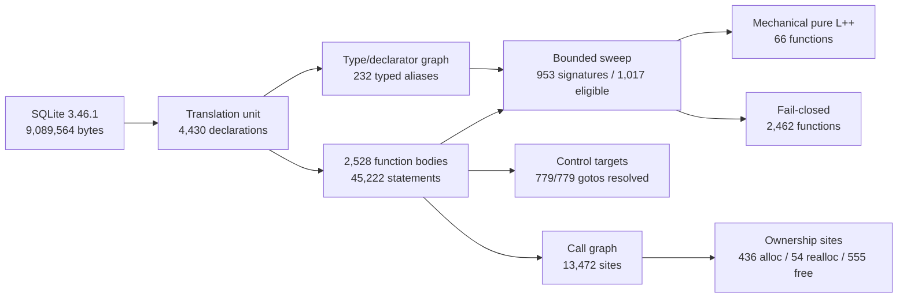

# c2lpp graph visualization plan

The analysis artifacts already contain stable IDs, source spans and edge records
needed for a viewer. A useful visualization should have two coordinated views:

1. a whole-translation-unit force graph;
2. a selected-function control-flow and ownership detail panel.

## Whole-unit view



The force graph would render:

- declarations as blue diamonds;
- functions as circles;
- direct calls as thin gray arrows;
- indirect/callback calls as dashed purple arrows;
- accepted functions as bright green nodes;
- rejected functions as muted gray nodes with the rejection code on hover;
- allocation edges in red, realloc in orange and free in dark red;
- unresolved ownership paths as amber halos;
- globals and aggregate types as teal rectangles.

At SQLite scale the 66 translated functions form small green islands connected by
accepted-call closure inside a much larger gray call network. Pager, B-tree,
VDBE, parser and JSON subsystems should be collapsible clusters rather than one
undifferentiated hairball.

## Function detail view

Selecting a function should replace the right panel with numbered basic blocks:

- solid edges for fallthrough;
- labeled true/false edges for branches;
- blue edges for switch cases;
- purple edges for goto;
- red ownership-transfer edges;
- terminal return blocks in green;
- unsupported statements in gray with source line/column and stable reason code.

The panel should also show the corresponding normalized IR and emitted L++ side
by side. Clicking an IR node should highlight its original C byte span and emitted
L++ line.

## Data sources

No new parser is required for a first viewer. It can consume:

```text
c2lpp.translation-unit.txt
c2lpp.declaration-graph.txt
c2lpp.function-body-graph.txt
c2lpp.call-graph.txt
c2lpp.control-graph.txt
c2lpp.ownership-graph.txt
c2lpp.normalized-ir.txt
c2lpp.function-sweep-report.txt
```

A later exporter can merge these into a compact JSON graph keyed by function name
and source span. Visualization is reporting only; it must never alter acceptance,
ownership proofs or mechanical translation counts.
