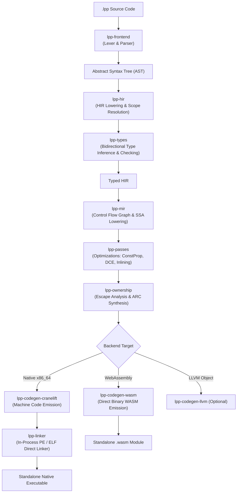

# Compiler Architecture

The L++ compiler is structured as a modern multi-stage, modular compiler written entirely in Rust (2024 edition). It is designed for maximum throughput, low memory footprint, and clean architectural separation of concerns.

---

## 1. Compilation Pipeline Overview

---

## 2. Pipeline Crates & Responsibilities

### `lpp-common`
The foundational crate shared across all stages:
- **`SourceMap` & `Span`:** Zero-copy source tracking for precise error diagnostics.
- **`Diagnostics`:** Rust-style error formatting with visual ASCII carets, source line excerpts, error codes (`E0001`–`E0010`), and actionable suggestions.
- **`Symbol` / String Interning:** Fast integer-based identifier comparisons across compilation phases.

### `lpp-frontend`
Translates raw UTF-8 source into an Abstract Syntax Tree:
- **Lexer:** Tokenizes source text, tracking indentation levels with virtual `INDENT` and `DEDENT` tokens to support significant whitespace.
- **Parser:** A recursive-descent parser that builds the strongly-typed AST (`Item`, `Expr`, `Stmt`, `Pattern`, `TypeNode`).
- **Resilience:** Collects multiple syntax errors in a single pass without cascading or aborting prematurely.

### `lpp-hir`
High-Level Intermediate Representation:
- **Module Resolution:** Resolves imports (`import math`, `from utils import helper`), file paths, and builds the dependency DAG.
- **Scope & Symbol Resolution:** Maps variable names to local, global, or closure-captured bindings.
- **Cross-Platform Path Normalization:** Guarantees consistent module resolution across Windows backslashes and Unix slashes.

### `lpp-types`
Type checking and inference:
- **Bidirectional Hindley-Milner Inference:** Infers expression types from context while enforcing explicit boundary annotations on functions and structs.
- **Generics & Monomorphization:** Monomorphizes generic functions and structs with recursion cycle detection.
- **Traits & Methods:** Verifies interface implementations and resolves static method dispatch.

### `lpp-mir`
Mid-Level Intermediate Representation:
- **Control-Flow Graph (CFG):** Transforms structured control flow (`if`, `while`, `match`) into basic blocks terminating in conditional and unconditional jumps.
- **SSA Representation:** Value definitions and uses are made explicit, simplifying static analysis and optimizations.

### `lpp-passes`
Optimization and transformation passes on the MIR:
- **Constant Propagation:** Evaluates compile-time constant arithmetic and boolean logic.
- **Dead Code Elimination (DCE):** Prunes unreachable basic blocks and unused local assignments.
- **Branch Simplification:** Collapses constant conditional jumps into direct branches.
- **Inlining:** Inlines small function bodies at call sites to eliminate call frame overhead.

### `lpp-ownership`
Deterministic memory safety without a garbage collector:
- **Escape Analysis:** Determines if allocated values escape their declaring function frame. Values that do not escape are stack-promoted.
- **ARC Synthesis:** Automatically inserts `retain` and `release` instructions for heap-allocated and shared values.
- **Borrow Validation:** Validates that references do not outlive their targets and detects double-frees and dangling references at compile time.

### `lpp-codegen-cranelift`
Default native code generation:
- Lowers MIR directly to Cranelift Intermediate Representation (CLIF).
- Compiles CLIF to target machine code (e.g. x86_64 machine instructions) at high throughput.
- Emits standard object files (COFF on Windows, ELF on Linux) or passes them directly to `lpp-linker`.

### `lpp-codegen-wasm`
Standalone WebAssembly backend:
- Directly writes the binary WebAssembly format (`.wasm`).
- Implements WASI system calls for I/O and pure-wasm memory allocation helpers.
- Requires no external wasm toolchains or linkers.

### `lpp-linker`
In-process direct linker:
- **PE/COFF Direct Linker:** Formats and writes standalone `.exe` binaries on Windows directly, resolving symbols and importing Windows runtime libraries without requiring MSVC `link.exe`.
- **ELF Direct Linker:** Formats standalone ELF executables for Linux.
- **Fallback System Linker:** Seamlessly invokes system linkers (`link.exe`, `gcc`, `ld`) when specialized native dependencies or C FFI libraries are requested.

---

## 3. Fast-Track Pipeline: `lpp check`

When running `lpp check`, the compiler executes through `lpp-frontend` $\rightarrow$ `lpp-hir` $\rightarrow$ `lpp-types` $\rightarrow$ `lpp-ownership` validation, skipping MIR optimization, Cranelift code generation, and linking. This provides instantaneous diagnostics (~50,000+ lines/sec) ideal for real-time editor feedback and CI checks.
